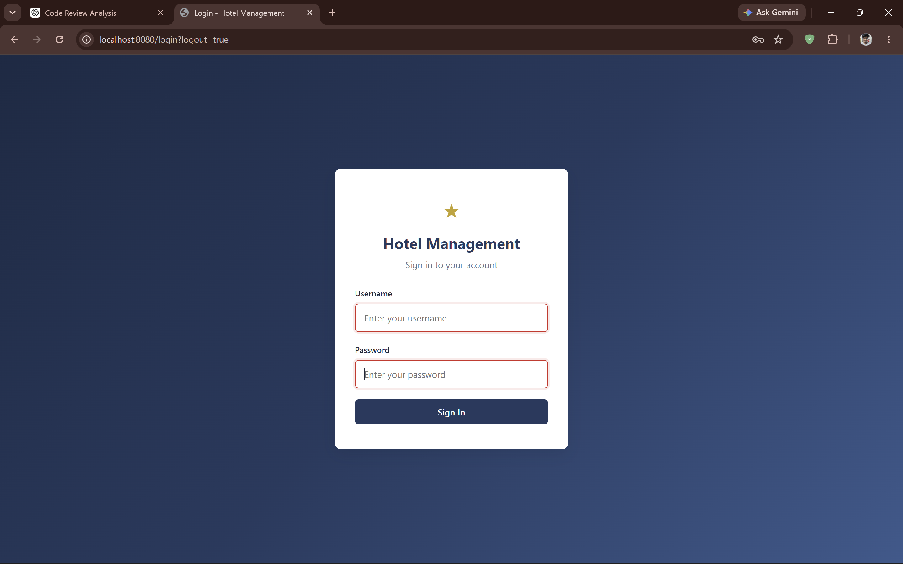
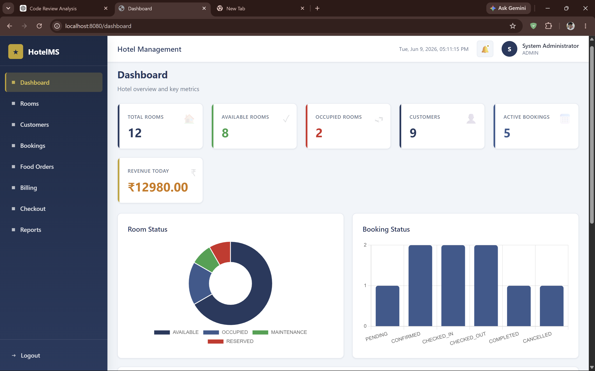
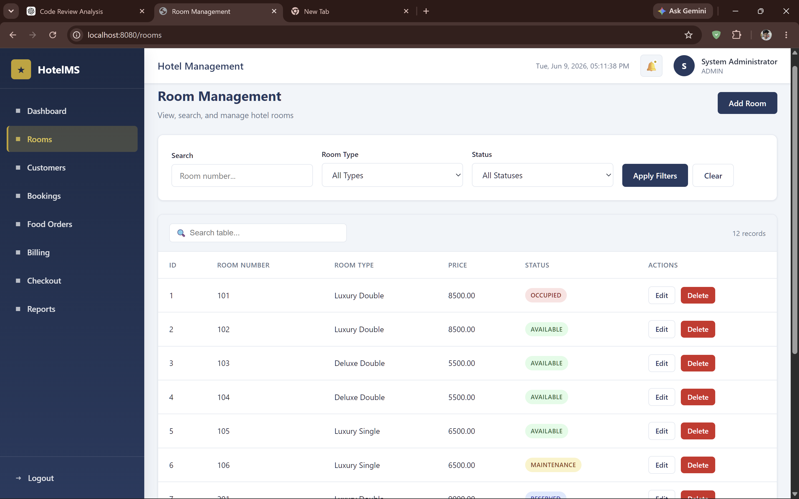
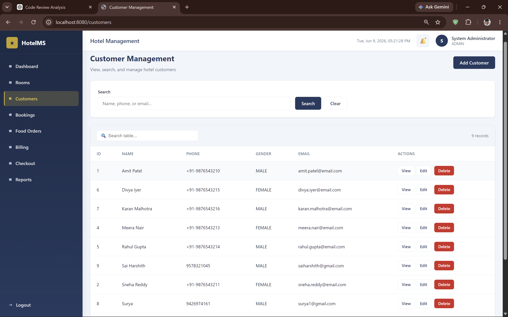
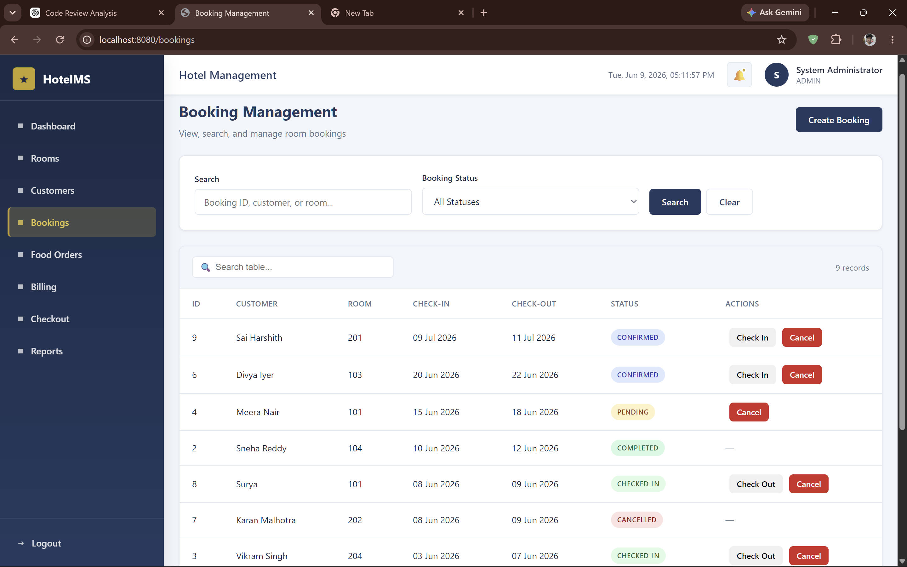
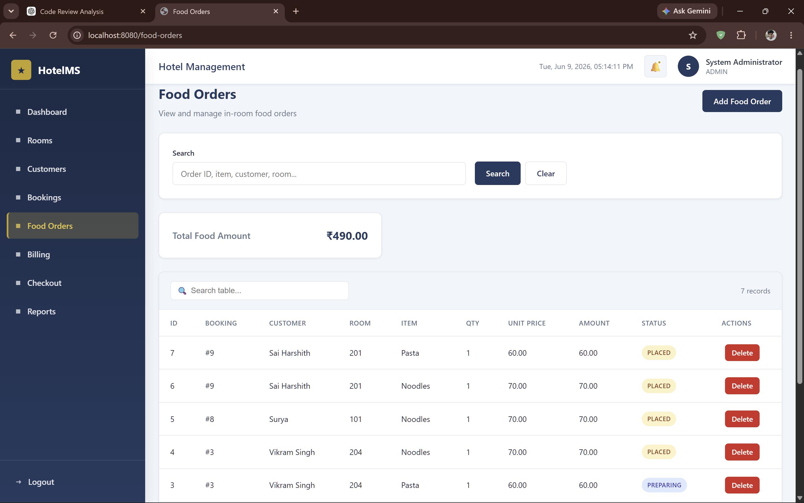
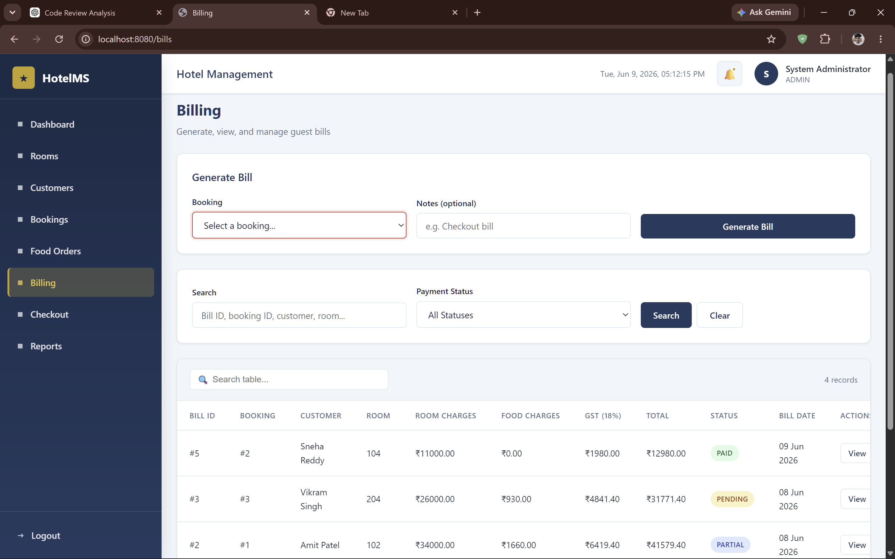
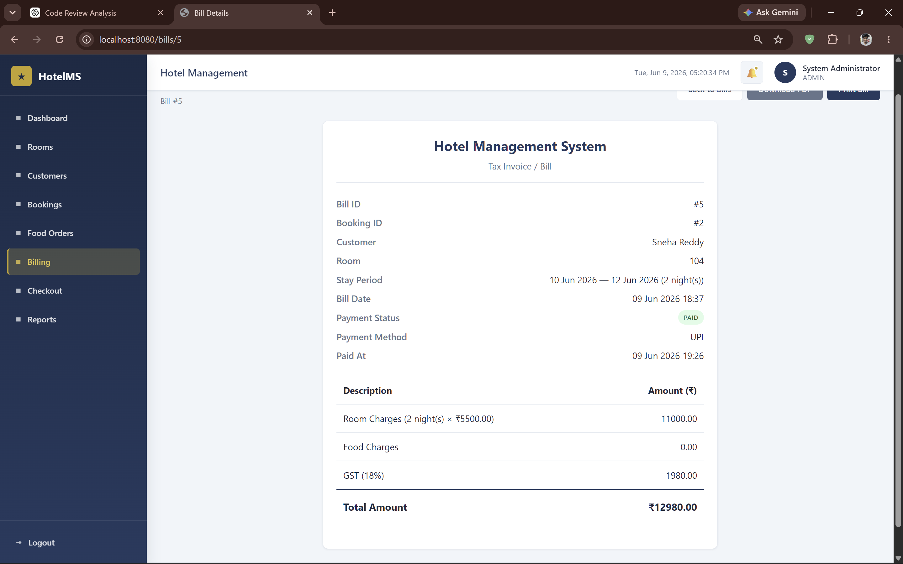

🏨 Hotel Management System

A full-stack Hotel Management System built using Java 17, Spring Boot, Spring Security, JDBC, MySQL, Thymeleaf, Maven, and Chart.js.
The system enables hotel staff to manage rooms, customers, bookings, food orders, billing, payments, and operational reports through a secure role-based dashboard.
________________________________________
✨ Key Features

🔐 Authentication & Security
•	Spring Security based authentication
•	BCrypt password encryption
•	Session management
•	CSRF protection
•	Role-based access control (RBAC)
👥 User Roles
Role	Permissions
ADMIN	Full system access
MANAGER	Dashboard, Reports, Operations
RECEPTIONIST	Customer, Booking, Billing operations
________________________________________
🏨 Room Management

•	Add new rooms
•	Update room information
•	Delete rooms
•	Room availability tracking
Room Statuses
•	AVAILABLE
•	RESERVED
•	OCCUPIED
•	MAINTENANCE
________________________________________
👤 Customer Management

•	Register customers
•	Update customer details
•	Search customers
•	Customer stay history
________________________________________
📅 Booking Management

Booking Workflow
Booking Created
       ↓
   CONFIRMED
       ↓
   CHECKED_IN
       ↓
   CHECKED_OUT
       ↓
 Bill Generated
       ↓
 Payment Received
       ↓
   COMPLETED
Features
•	Create booking
•	Cancel booking
•	Check-In
•	Check-Out
•	Automatic room status updates
•	Booking validation
________________________________________
🍽 Food Order Management

•	Place food orders
•	Associate orders with bookings
•	Automatic billing integration
•	Order tracking
________________________________________
💳 Billing & Payments

Billing Features
•	Automatic bill generation
•	GST calculation
•	Room charge calculation
•	Food charge integration
•	Payment tracking
Payment Methods
•	CASH
•	CARD
•	UPI
•	ONLINE
Invoice Features
•	PDF invoice generation
•	Printable bills
•	Payment status tracking
________________________________________
📊 Dashboard Analytics

The dashboard provides real-time statistics:
•	Total Rooms
•	Available Rooms
•	Occupied Rooms
•	Total Customers
•	Active Bookings
•	Revenue Today
Charts
•	Room Status Distribution
•	Booking Status Distribution
•	Revenue Trend (Last 7 Days)
________________________________________
🏗 System Architecture

┌──────────────────────┐
│      Browser         │
│   Thymeleaf Views    │
└──────────┬───────────┘
           │
           ▼
┌──────────────────────┐
│     Controllers      │
│     Spring MVC       │
└──────────┬───────────┘
           │
           ▼
┌──────────────────────┐
│      Services        │
│   Business Logic     │
└──────────┬───────────┘
           │
           ▼
┌──────────────────────┐
│        DAO           │
│    Spring JDBC       │
└──────────┬───────────┘
           │
           ▼
┌──────────────────────┐
│       MySQL          │
│      Database        │
└──────────────────────┘
________________________________________
🗄 Database Design

Tables
•	users
•	rooms
•	customers
•	bookings
•	food_orders
•	bills
Relationships
Customer (1) ────── (M) Booking

Room (1) ────────── (M) Booking

Booking (1) ─────── (M) Food Orders

Booking (1) ─────── (1) Bill
________________________________________
🛠 Technology Stack

Backend
•	Java 17
•	Spring Boot
•	Spring Security
•	Spring JDBC
Frontend
•	Thymeleaf
•	HTML5
•	CSS3
•	JavaScript
•	Chart.js
Database
•	MySQL
Build Tool
•	Maven
PDF Generation
•	OpenPDF
Version Control
•	Git
•	GitHub
________________________________________
📂 Project Structure

src/main/java/com/hotel
│
├── config
├── controller
├── dao
├── service
├── model
├── security
├── exception
├── util
└── HotelManagementApplication
________________________________________
⚙️ Database Setup

Create Database
CREATE DATABASE hotel_management;
Configure application.properties
spring.datasource.url=jdbc:mysql://localhost:3306/hotel_management
spring.datasource.username=root
spring.datasource.password=your_password
spring.datasource.driver-class-name=com.mysql.cj.jdbc.Driver
________________________________________
▶️ Running the Application

Clone Repository
git clone https://github.com/SaiHarshith093/Hotel-management.git
cd Hotel-management
Build
mvn clean install
Run
mvn spring-boot:run
Application URL:
http://localhost:8080
________________________________________
📷 Application Screenshots

Login Page

 
Dashboard

 
Room Management

 
Customer Management

 
Booking Management

 
Food Orders

 
Billing
 
 
Invoice

 
________________________________________
🔒 Security Features

•	Spring Security Authentication
•	BCrypt Password Encryption
•	Session Management
•	CSRF Protection
•	Role-Based Authorization
________________________________________
🚀 Future Enhancements

•	Docker Containerization
•	Email Notifications
•	Online Payment Gateway Integration
•	REST API Support
•	Inventory Management
•	Customer Feedback Module
•	Cloud Deployment (AWS / Azure / Railway)
•	Mobile Application Support
________________________________________
👨‍💻 Author

Sai Harshith
GitHub:
https://github.com/SaiHarshith093
________________________________________
📄 License

This project is developed for educational and portfolio purposes.

